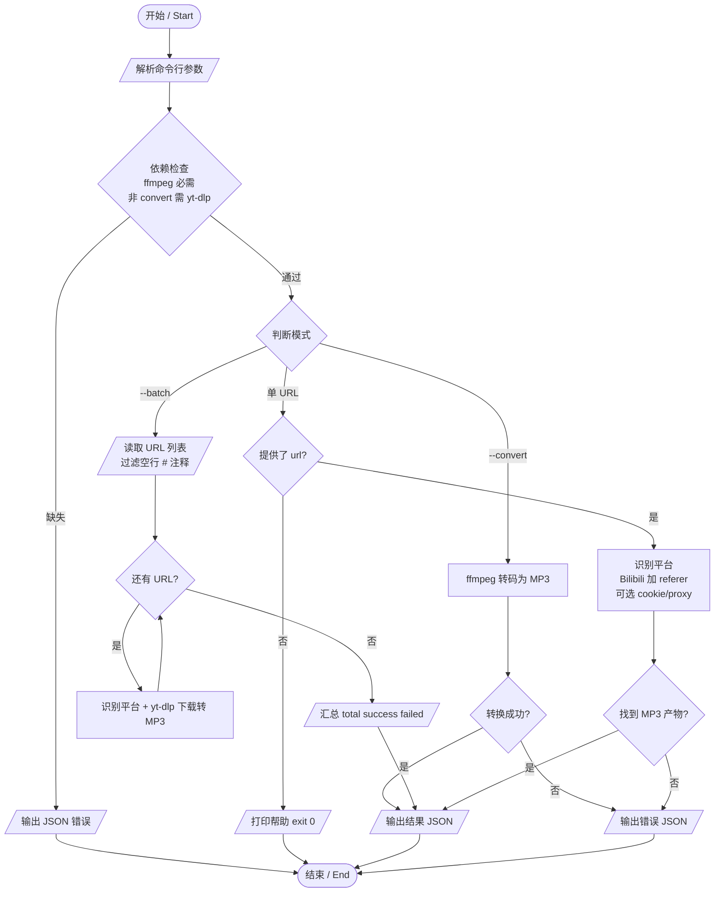

# 音乐下载 & MP3 转换 / Music Download & MP3 Conversion

## 功能简介 / Overview

**中文**：本技能基于 `yt-dlp` + `ffmpeg`，可从 1000+ 主流平台（YouTube、Bilibili、网易云音乐、QQ 音乐等）下载音视频并抽取转换为 MP3。支持三种模式：单链接下载、批量下载（从 URL 列表文件读取）、本地音频转 MP3。脚本以 JSON 形式返回结果，便于程序化调用。

**English**: Powered by `yt-dlp` + `ffmpeg`, this skill downloads audio/video from 1000+ platforms (YouTube, Bilibili, NetEase Cloud Music, QQ Music, etc.) and extracts them to MP3. It offers three modes: single-URL download, batch download (from a URL list file), and local audio-to-MP3 conversion. Results are returned as JSON for easy programmatic use.

## 技术规格 / Technical Specifications

| 项目 / Item | 说明 / Details |
|------|------|
| 底层工具 / Engines | `yt-dlp`（下载）、`ffmpeg`（音频编码，libmp3lame） |
| 输出格式 / Output | MP3（内嵌封面缩略图 + 元数据） |
| 本地转换输入 / Local input | ffmpeg 支持的格式：flac、wav、m4a、ogg、aac、wma、opus 等 |
| 比特率 / Bitrate | `128k` / `192k` / `256k` / `320k`（默认 `320k`） |
| 下载超时 / Download timeout | 600 秒 |
| 本地转换超时 / Convert timeout | 300 秒 |
| 运行环境 / Runtime | Python 3.x，macOS / Linux |
| 依赖 / Dependencies | `yt-dlp`、`ffmpeg`（`--convert` 模式仅需 `ffmpeg`） |

### 支持平台 / Supported Platforms

| 平台 / Platform | Cookie 必需 | 备注 / Notes |
|------|:---:|------|
| 网易云音乐 / QQ音乐 | ✅ | 需导出浏览器 cookie（Netscape 格式） |
| 酷狗 / 酷我 | 部分 | 部分资源需登录态 |
| Bilibili | 部分 | 脚本自动附加 `--referer`；部分视频需登录 |
| YouTube / SoundCloud / Spotify | ❌ | 境外平台可能需 `--proxy` |
| 其他（yt-dlp 支持的 1000+ 站点） | 视情况 | 未匹配到内置规则时归为“其他平台” |

## 环境前置条件 / Prerequisites

```bash
# macOS
brew install yt-dlp ffmpeg
# 或 / or
pip install yt-dlp && brew install ffmpeg

# Linux
pip install yt-dlp
# ffmpeg：apt install ffmpeg / dnf install ffmpeg
```

依赖检查会自动在脚本启动时执行；若缺失将直接以 JSON 报错退出（退出码 1）。

## API 调用方式 / API & Parameters

```bash
python3 SKILL_DIR/scripts/music_download.py [url] [options]
```

| 参数 / Argument | 类型 | 必填 | 默认值 | 说明 |
|------|------|:---:|------|------|
| `url`（位置参数） | string | 单链接模式必填 | — | 音频/视频页面地址 |
| `--batch <file>` | string | 批量模式必填 | — | URL 列表文本文件（每行一个 URL，`#` 开头为注释） |
| `--convert <file>` | string | 本地转换模式必填 | — | 本地音频文件路径 |
| `-o, --output <dir>` | string | 否 | `./downloads` | 输出目录 |
| `-b, --bitrate <rate>` | enum | 否 | `320k` | 取值：`128k`/`192k`/`256k`/`320k` |
| `--cookie <path>` | string | 否 | 无 | cookie 文件路径（Netscape 格式）；仅在文件存在时生效 |
| `--proxy <addr>` | string | 否 | 无 | 代理地址，如 `http://127.0.0.1:7890` |
| `-h, --help` | flag | 否 | — | 显示帮助 |

**模式互斥说明**：三种模式按 `--convert` → `--batch` → `url` 的优先级判定，同一次调用只走一条路径；不带任何输入时打印帮助并以退出码 0 结束。`--cookie` / `--proxy` 仅对下载模式（单链接 / 批量）生效。

## 使用示例 / Usage Examples

### 1. 单链接下载转 MP3

```bash
python3 SKILL_DIR/scripts/music_download.py "https://www.youtube.com/watch?v=xxxx" \
  --output "./downloads" \
  --bitrate 320k
```

### 2. 批量下载（URL 列表文件）

`url_list.txt` 示例：

```text
# 我的歌单
https://www.bilibili.com/video/BVxxxx
https://music.163.com/song?id=xxxx
```

```bash
python3 SKILL_DIR/scripts/music_download.py --batch "./url_list.txt" \
  --output "./downloads" \
  --bitrate 256k
```

### 3. 本地文件转 MP3

```bash
python3 SKILL_DIR/scripts/music_download.py --convert "./song.flac" \
  --output "./downloads" \
  --bitrate 320k
```

### 4. 需要登录的平台（网易云 / QQ 音乐）

```bash
python3 SKILL_DIR/scripts/music_download.py "https://music.163.com/song?id=xxxx" \
  --cookie "./netease_cookies.txt" \
  --bitrate 320k
```

### 5. 境外平台走代理

```bash
python3 SKILL_DIR/scripts/music_download.py "https://soundcloud.com/xxxx" \
  --proxy "http://127.0.0.1:7890"
```

### Cookie 文件获取 / How to Export Cookies

登录目标平台 → 安装浏览器扩展「Get cookies.txt LOCALLY」→ 导出 Netscape 格式 → 通过 `--cookie` 传入。

## 输出格式 / Output

单文件成功：

```json
{
  "success": true,
  "file": "/absolute/path/to/song.mp3",
  "title": "歌曲标题",
  "size_mb": 8.52,
  "bitrate": "320k",
  "platform": "YouTube"
}
```

> 注：`--convert` 本地转换成功时不含 `platform` 字段。

批量模式：

```json
{
  "total": 10,
  "success": 9,
  "failed": 1,
  "results": [
    { "url": "https://...", "success": true, "file": "...", "title": "...", "size_mb": 5.1, "bitrate": "320k", "platform": "Bilibili" },
    { "url": "https://...", "success": false, "error": "..." }
  ]
}
```

失败：

```json
{
  "success": false,
  "error": "错误描述"
}
```

**退出码**：单任务成功 0 / 失败 1；批量模式全部成功 0，存在失败 1。

## 错误处理 / Error Handling

| 现象 | 原因 | 解决方案 |
|------|------|------|
| `yt-dlp 未安装` | 缺少 yt-dlp | `brew install yt-dlp` 或 `pip install yt-dlp` |
| `ffmpeg 未安装` | 缺少 ffmpeg | `brew install ffmpeg` |
| `下载超时（600s）` | 网络慢 / 被墙 | 使用 `--proxy` 或检查网络 |
| `yt-dlp 退出码 N: ...` | 需登录 / 链接失效 / 地区限制 | 使用 `--cookie`，或核对链接与地区限制 |
| `下载完成但未找到 MP3 文件` | 抽取失败 | 检查 ffmpeg 是否正常、源是否含音轨 |
| `文件不存在`（转换模式） | 路径错误 | 核对本地文件路径 |

## 使用流程图 / Flowchart



## 注意事项 / Notes

- 请仅下载/转换你拥有合法权利的内容，尊重版权与各平台服务条款。
- Cookie 文件包含登录凭据，请妥善保管，勿提交到版本库。
