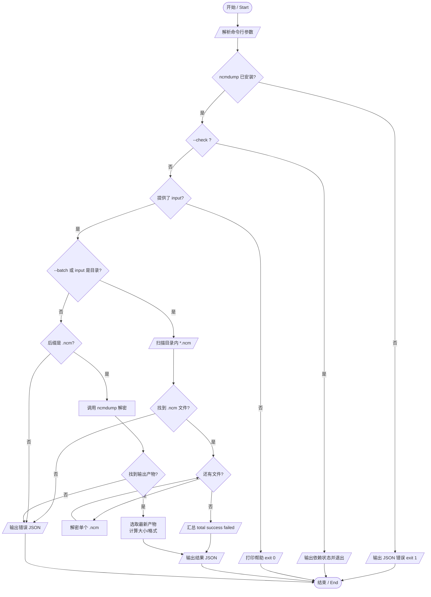

# NCM 加密音乐解密 & 转换 / NCM Decryption & Conversion

## 功能简介 / Overview

**中文**：本技能基于 `ncmdump`，将网易云音乐 `.ncm` 加密文件还原为原始音频（MP3 / FLAC 等）。支持两种模式：单文件解密、目录批量解密（自动识别或显式 `--batch`）。另提供 `--check` 依赖自检。结果以 JSON 形式返回，便于程序化调用。

**English**: Powered by `ncmdump`, this skill decrypts NetEase Cloud Music `.ncm` files back to their original audio (MP3 / FLAC, etc.). Two modes are supported: single-file decryption and batch directory decryption (auto-detected or explicit `--batch`), plus a `--check` dependency self-test. Results are returned as JSON for easy programmatic use.

## 技术规格 / Technical Specifications

| 项目 / Item | 说明 / Details |
|------|------|
| 底层工具 / Engine | `ncmdump` |
| 输入格式 / Input | `.ncm`（网易云会员下载的加密文件） |
| 输出格式 / Output | 取决于原始上传格式，脚本识别 `mp3` / `flac` / `ogg` / `m4a` / `wav` |
| 解密超时 / Timeout | 120 秒 / 文件 |
| 运行环境 / Runtime | Python 3.x，macOS / Linux |
| 依赖 / Dependencies | `ncmdump`（必需）；`ffmpeg`（一并检查，非解密必需） |

## 环境前置条件 / Prerequisites

```bash
# macOS
brew install ncmdump

# Linux：从源码编译
# https://github.com/anonymous5l/ncmdump
```

依赖检查会在脚本启动时自动执行；若 `ncmdump` 缺失将直接以 JSON 报错退出（退出码 1）。

## API 调用方式 / API & Parameters

```bash
python3 SKILL_DIR/scripts/ncm_convert.py [input] [options]
```

| 参数 / Argument | 类型 | 必填 | 默认值 | 说明 |
|------|------|:---:|------|------|
| `input`（位置参数） | string | 除 `--check` 外必填 | — | `.ncm` 文件路径，或包含 `.ncm` 的目录 |
| `-o, --output <dir>` | string | 否 | 源文件同目录 | 输出目录 |
| `--batch` | flag | 否 | false | 强制批量模式（目录）；传入目录时也会自动识别 |
| `--check` | flag | 否 | false | 仅检查依赖并退出 |
| `-h, --help` | flag | 否 | — | 显示帮助 |

**模式判定**：`--check` 优先；否则当 `--batch` 为真或 `input` 为目录时走批量，`input` 为文件时走单文件；不带 `input` 时打印帮助并以退出码 0 结束。

## 使用示例 / Usage Examples

### 1. 单文件解密

```bash
python3 SKILL_DIR/scripts/ncm_convert.py "./song.ncm" \
  --output "./output"
```

### 2. 目录批量解密（自动识别）

```bash
python3 SKILL_DIR/scripts/ncm_convert.py "./ncm_folder"
```

### 3. 显式批量模式 + 指定输出目录

```bash
python3 SKILL_DIR/scripts/ncm_convert.py --batch "./ncm_folder" \
  --output "./output"
```

### 4. 依赖自检

```bash
python3 SKILL_DIR/scripts/ncm_convert.py --check
# 输出：{ "ncmdump": true, "ffmpeg": true }
```

## 输出格式 / Output

单文件成功：

```json
{
  "success": true,
  "file": "/absolute/path/to/song.mp3",
  "title": "歌曲标题",
  "format": "mp3",
  "size_mb": 8.52
}
```

批量模式：

```json
{
  "total": 28,
  "success": 28,
  "failed": 0,
  "results": [
    { "source": "song.ncm", "success": true, "file": "...", "title": "...", "format": "flac", "size_mb": 30.1 }
  ]
}
```

失败：

```json
{
  "success": false,
  "error": "错误描述"
}
```

**退出码**：单文件成功 0 / 失败 1；批量全部成功 0，存在失败 1；`--check` 依赖齐全 0 否则 1。

## 错误处理 / Error Handling

| 现象 | 原因 | 解决方案 |
|------|------|------|
| `ncmdump 未安装` | 缺少 ncmdump | `brew install ncmdump`（Linux 见前置条件） |
| `不是 .ncm 文件` | 输入后缀非 `.ncm` | 核对文件类型 |
| `文件不存在 / 目录不存在` | 路径错误 | 核对路径 |
| `目录下未找到 .ncm 文件` | 批量目录无匹配文件 | 确认目录含 `.ncm` 文件 |
| `解密超时（120s）` | 单文件过大 / 卡住 | 重试或单独处理该文件 |
| `解密完成但未找到输出文件` | ncmdump 产物未落地 | 确认输出目录可写、ncmdump 正常 |

## 使用流程图 / Flowchart



## 注意事项 / Notes

- `.ncm` 仅通过会员下载获得；解密后格式取决于原始上传格式（MP3 / FLAC）。
- 本工具仅用于个人已购买音乐的格式转换，请尊重版权。
